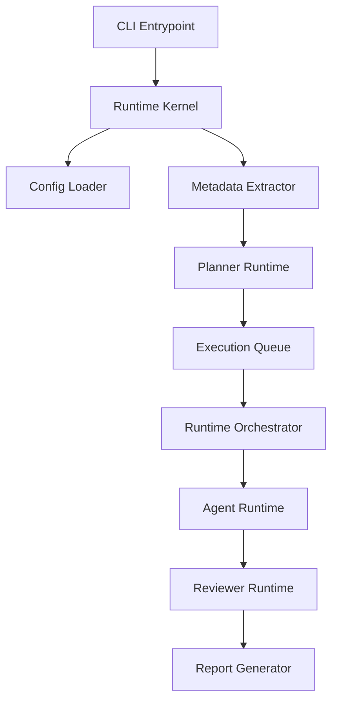
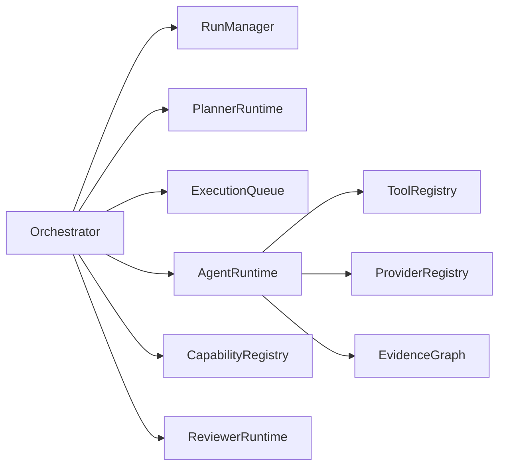
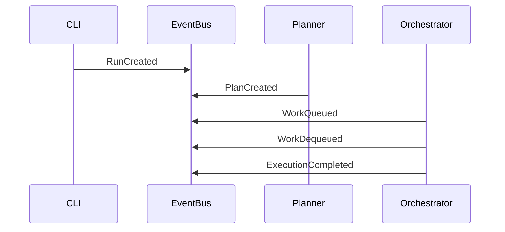
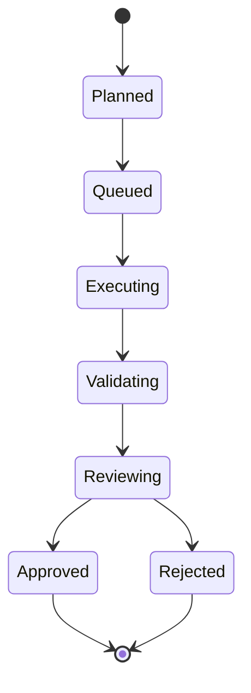
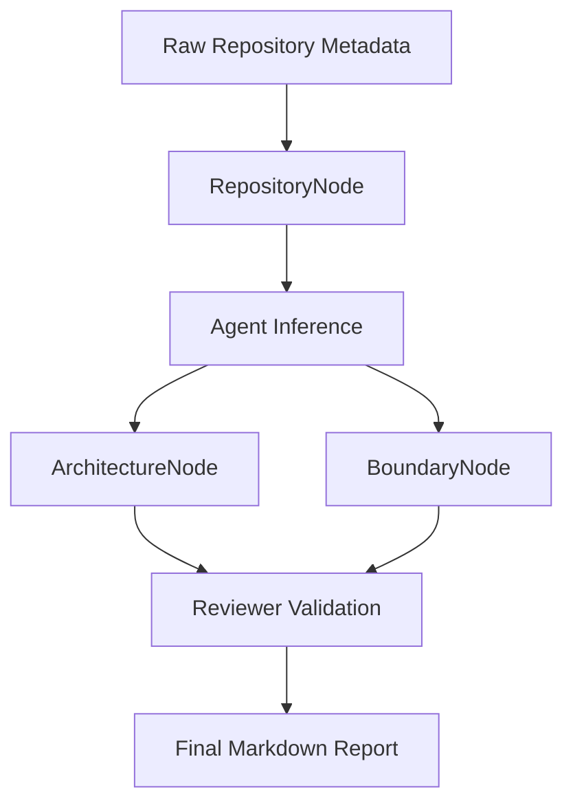

# ArchMind AI

ArchMind AI is a production-grade AI Operating System for software architecture analysis. It is designed to analyze an entire software repository while respecting a strict privacy boundary. Instead of sending source code to an LLM, it extracts deterministic metadata locally, builds a canonical Evidence Graph, and reasons over that graph using specialized AI agents.

## Features
- **Privacy First**: Source code never leaves your machine. Only extracted metadata (dependencies, file structures, package info) is sent to the LLM.
- **Event-Driven Architecture**: Powered by a deterministic `EventBus` and `EvidenceGraph`.
- **Dynamic Agent Dispatch**: Pluggable AI agents using a `CapabilityRegistry` and strict `Zod` validation.
- **Local AI Support**: Out-of-the-box support for Ollama.

## Installation

```bash
# Clone the repository
git clone https://github.com/your-org/archmind-ai.git
cd archmind-ai

# Install dependencies
npm install

# Build the CLI
npm run build
```

## Usage

ArchMind AI exposes a CLI for analyzing repositories.

```bash
# Analyze a target repository
npx archmind analyze /path/to/repo

# Specify a custom config file
npx archmind analyze /path/to/repo --config archmind.config.json

# Specify a custom output report path
npx archmind analyze /path/to/repo --output my-report.md
```

### Example

We have provided a sample repository in the `examples/sample-repo` directory. You can test ArchMind AI by running:

```bash
npm run build
node ./dist/cli/index.js analyze ./examples/sample-repo
```

## Configuration

You can customize the runtime by placing an `archmind.config.json` in your current working directory.

```json
{
  "timeouts": {
    "providerTimeoutMs": 60000,
    "agentTimeoutMs": 120000
  },
  "retryPolicy": {
    "maxAttempts": 3,
    "backoffMs": 1000
  },
  "reviewer": {
    "minimumConfidenceThreshold": 0.90
  }
}
```

## Architecture

ArchMind AI strictly follows a deterministic execution pipeline:

1. **Deterministic Extraction**: The `RepositoryIntelligenceEngine` scans the local filesystem, executing tools like `TypeScriptAstExtractor`, `PackageJsonExtractor`, and `DockerfileExtractor` to populate the Evidence Graph with unassailable facts.
2. **Planning**: The `PlannerRuntime` determines which agents to run based on the available deterministic evidence.
3. **Execution**: The `RuntimeOrchestrator` runs agents via the `AgentRuntime`.
4. **Validation**: Agent outputs are strictly parsed via Zod.
5. **Review**: The `ReviewerRuntime` verifies the generated Evidence Graph.
6. **Reporting**: The `ReportGenerator` creates a human-readable markdown file.

### 1. Runtime Pipeline


### 2. Dependency Graph


### 3. Event Flow


### 4. Agent Lifecycle


### 5. Evidence Graph Lifecycle


## Roadmap

- **v0.1**: Initial CLI, Config Loader, and Reporting Engine.
- **v0.2**: Specialized Agents (Security, DevOps, Documentation, Dependencies).
- **v1.0**: Full repository analysis capability.

## Contributing

Please review `docs/ENGINEERING_CONSTITUTION.md` before making any changes. The architecture is strict, event-driven, and highly decoupled.