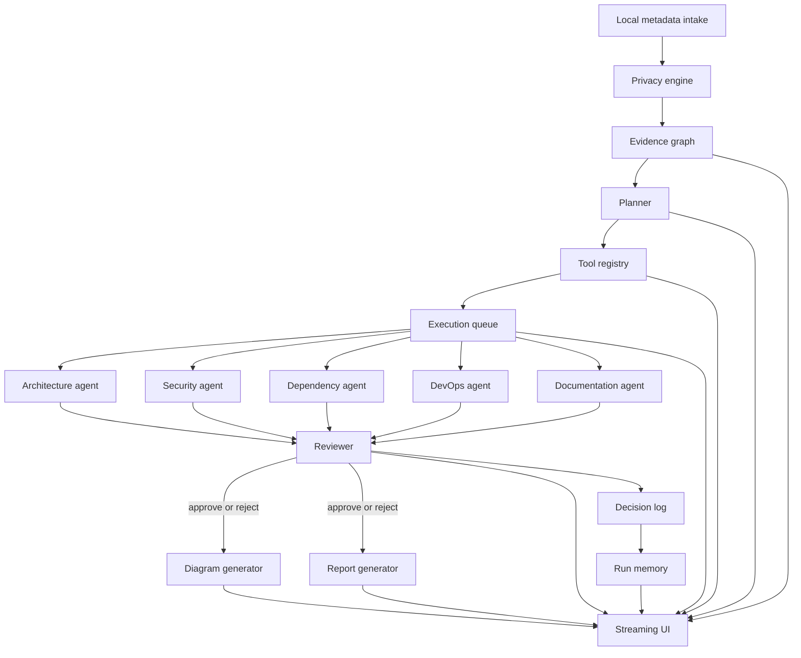
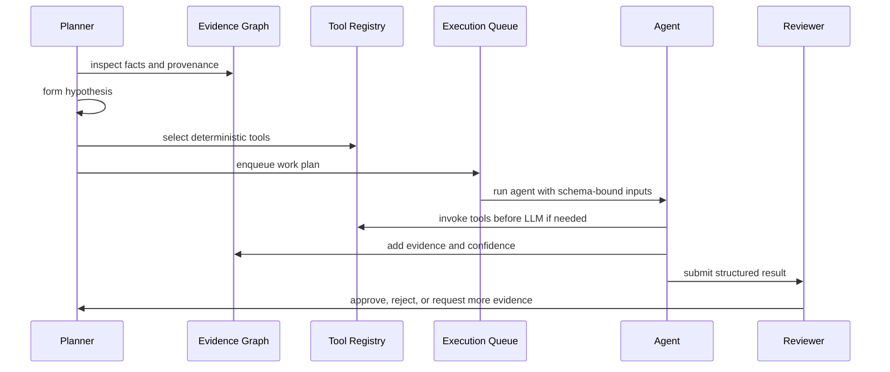

# Proposed Architecture

## System shape

ArchMind AI should be an event-driven analysis platform with a strict privacy boundary.

## Core layers

### 1. Privacy and ingestion layer

This layer collects metadata only. It should normalize repositories into a local, sanitized graph of facts such as packages, dependencies, files, symbols, interfaces, build scripts, and inferred architecture signals. Raw source code must not be transmitted to external providers.

The evidence graph is the canonical internal representation of the repository. It stores facts, provenance, confidence, relationships, and derivation history so every downstream decision can be traced back to evidence.

### 2. Orchestration layer

The planner does not just route work. It reasons over the evidence graph, forms hypotheses, determines what evidence is missing, decides which deterministic tools or agents are needed, and chooses whether to stop, continue, or re-run analysis.

The execution queue expands planner decisions into sequential or parallel work units. The planner can request another pass when confidence is low or contradictions remain unresolved.

### 3. Agent layer

Each agent has a narrow responsibility and must emit structured output only. The output schema should include role, goal, input schema, output schema, confidence score, evidence, reasoning, and validation fields.

Agents should prefer deterministic tools first and use the LLM for synthesis, classification, and explanation. That keeps the system auditable and reduces unnecessary model reliance.

### 4. Review and synthesis layer

The reviewer validates contradictions, confidence, evidence quality, completeness, and whether the hypotheses actually follow from the evidence graph. It can reject results and request another analysis pass. Only reviewer-approved work should flow into diagrams and reports.

Every analysis run should produce a decision log containing planner decisions, tool invocations, agent outputs, reviewer outcomes, and rerun triggers. That log feeds run memory, which preserves summaries, deltas, and trend signals for future comparison.

### 5. Presentation layer

The UI should render the live orchestration state as the primary experience. The orchestration graph is the interface. Reports are the end of the flow, not the center of it.

The UI should expose live confidence, evidence provenance, and rerun decisions so the user can watch the system think.

## Architectural constraints

- Metadata-only analysis is a non-negotiable privacy boundary.
- Model providers must be abstracted behind a runtime adapter.
- Every agent contract must be schema-validated before and after model execution.
- Analysis should be event-sourced so the UI and audit trail can replay the same run.
- The system should support local-first operation with optional remote inference providers.
- Deterministic tools should run before LLM calls whenever they can produce stronger evidence.
- The evidence graph and decision log are first-class runtime assets, not incidental implementation details.
- Run memory should preserve prior analysis summaries, deltas, and trend signals for comparison across sessions.

## Extensibility points

- New agents can be added by registering a schema and planner capability rule.
- New providers can be added without changing orchestration logic.
- New report formats can consume the same reviewed graph of facts.
- New UI surfaces can subscribe to the same event stream.
- New tools can be added to the tool registry without changing agent implementations.