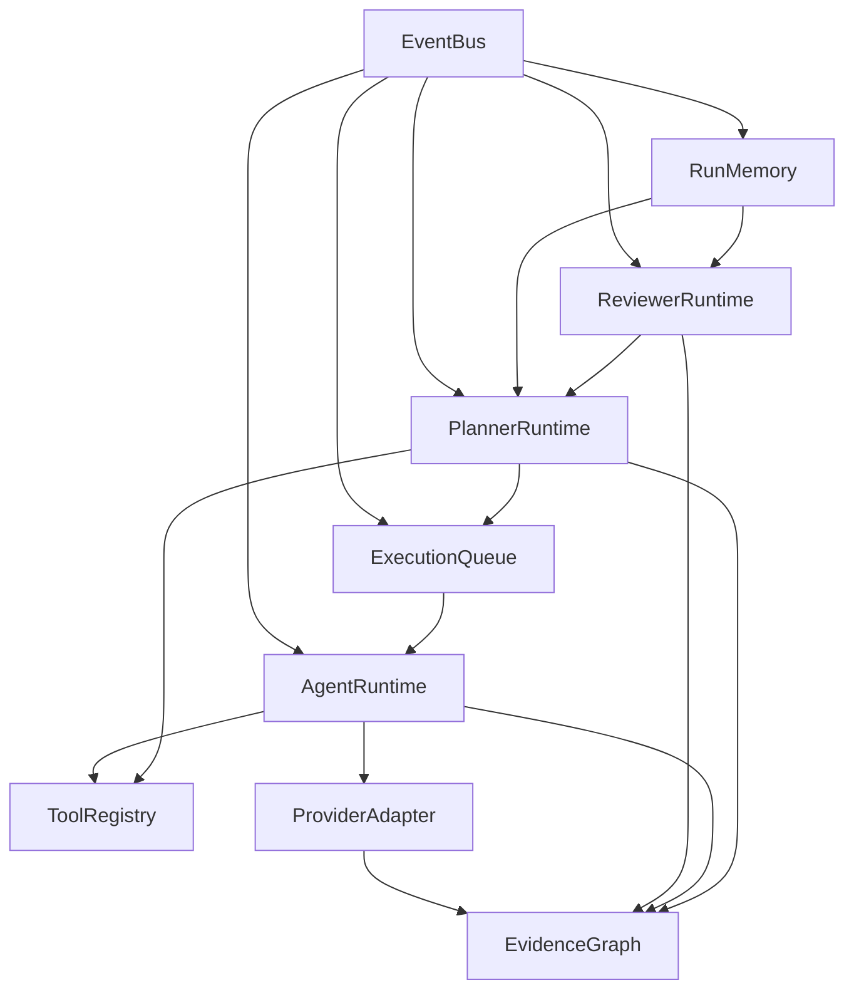
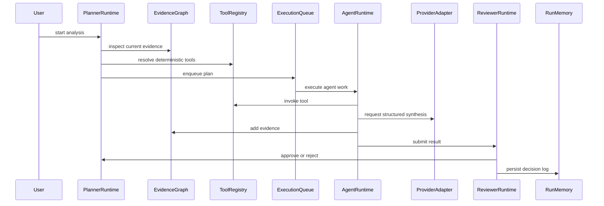
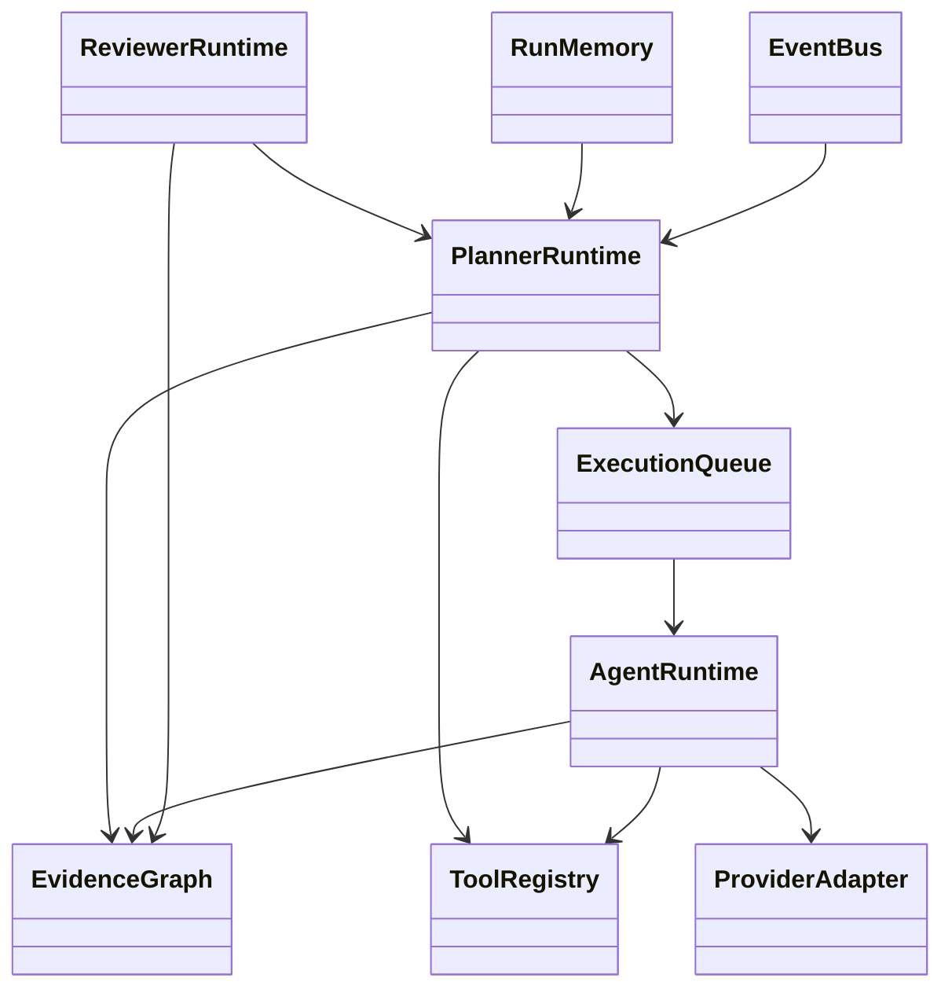
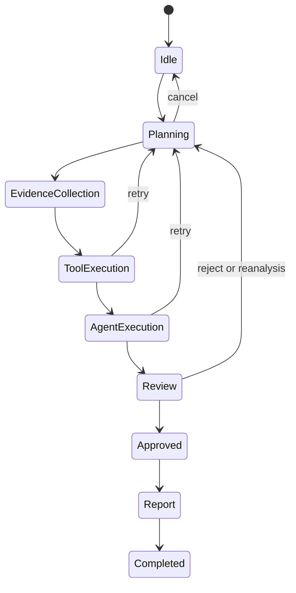
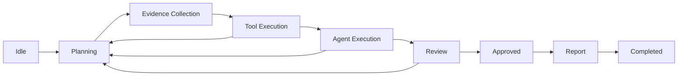

# Diagrams

## Component Diagram

```mermaid
flowchart TD
  P[PlannerRuntime] --> E[EvidenceGraph]
  P --> Q[ExecutionQueue]
  P --> T[ToolRegistry]
  Q --> A[AgentRuntime]
  A --> B[ProviderAdapter]
  A --> T
  A --> E
  R[ReviewerRuntime] --> E
  R --> P
  B --> E
  M[RunMemory] --> P
  M --> R
  BUS[EventBus] --> P
  BUS --> Q
  BUS --> A
  BUS --> R
  BUS --> M
```

## Sequence Diagram

```mermaid
sequenceDiagram
  participant U as User
  participant P as PlannerRuntime
  participant G as EvidenceGraph
  participant T as ToolRegistry
  participant Q as ExecutionQueue
  participant A as AgentRuntime
  participant B as ProviderAdapter
  participant R as ReviewerRuntime
  participant M as RunMemory

  U->>P: start analysis
  P->>G: inspect current evidence
  P->>T: resolve deterministic tools
  P->>Q: enqueue plan
  Q->>A: execute agent work
  A->>T: invoke tool
  A->>B: request structured synthesis
  A->>G: add evidence
  A->>R: submit result
  R->>P: approve or reject
  R->>M: persist decision log
```

## Class Diagram

```mermaid
classDiagram
  class PlannerRuntime
  class AgentRuntime
  class ExecutionQueue
  class EventBus
  class EvidenceGraph
  class ToolRegistry
  class ProviderAdapter
  class ReviewerRuntime
  class RunMemory

  PlannerRuntime --> EvidenceGraph
  PlannerRuntime --> ToolRegistry
  PlannerRuntime --> ExecutionQueue
  ExecutionQueue --> AgentRuntime
  AgentRuntime --> ToolRegistry
  AgentRuntime --> ProviderAdapter
  AgentRuntime --> EvidenceGraph
  ReviewerRuntime --> EvidenceGraph
  ReviewerRuntime --> PlannerRuntime
  RunMemory --> PlannerRuntime
  EventBus --> PlannerRuntime
```

## State Diagram

```mermaid
stateDiagram-v2
  [*] --> Idle
  Idle --> Planning
  Planning --> EvidenceCollection
  EvidenceCollection --> ToolExecution
  ToolExecution --> AgentExecution
  AgentExecution --> Review
  Review --> Approved
  Approved --> Report
  Report --> Completed
  Review --> Planning: reject or reanalysis
  AgentExecution --> Planning: retry
  ToolExecution --> Planning: retry
  Planning --> Idle: cancel
```

## Runtime Flow Diagram

```mermaid
flowchart LR
  I[Idle] --> P[Planning]
  P --> E[Evidence Collection]
  E --> T[Tool Execution]
  T --> A[Agent Execution]
  A --> R[Review]
  R --> AP[Approved]
  AP --> RP[Report]
  RP --> C[Completed]
  R --> P
  A --> P
  T --> P
```