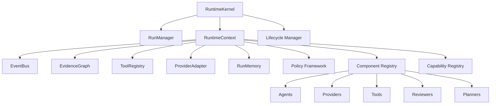
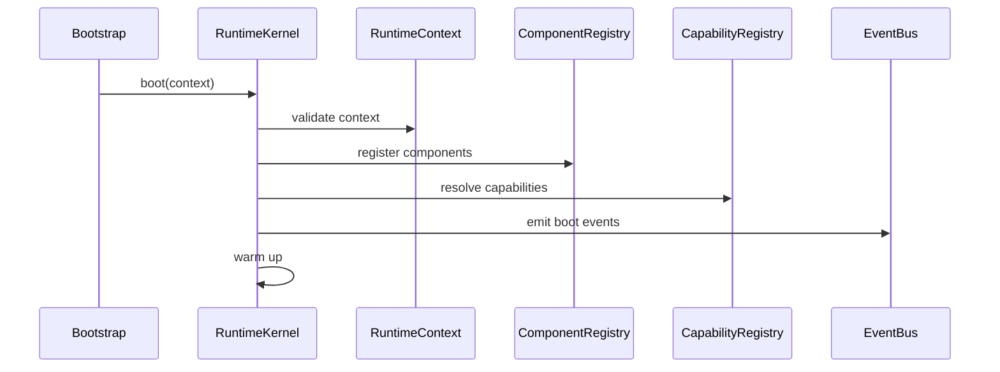
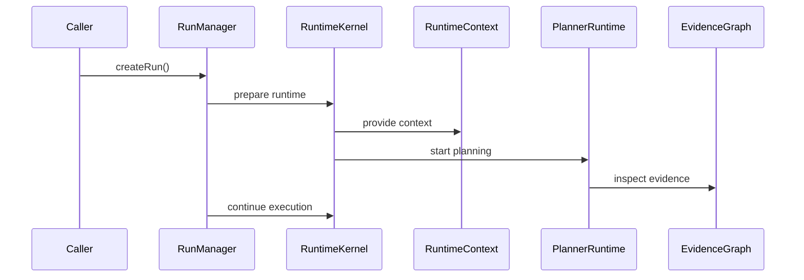
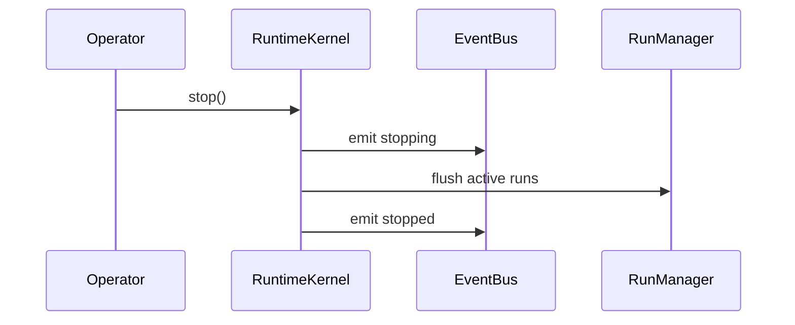
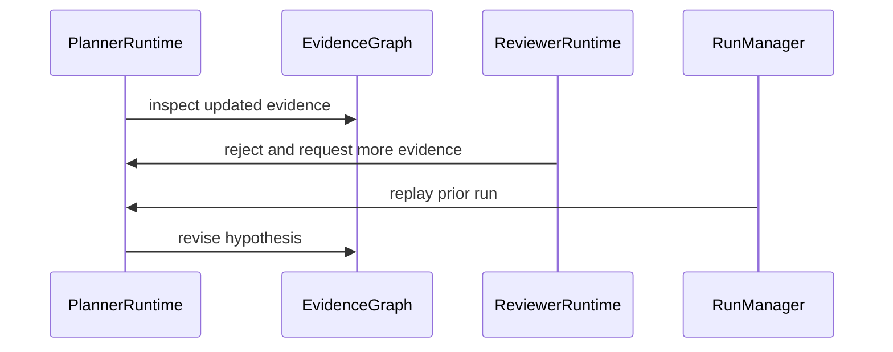

# Diagrams

## Component Diagram

```mermaid
flowchart TD
  K[RuntimeKernel] --> R[RunManager]
  K --> C[RuntimeContext]
  C --> E[EventBus]
  C --> G[EvidenceGraph]
  C --> T[ToolRegistry]
  C --> P[ProviderAdapter]
  C --> M[RunMemory]
  C --> PC[Policy Framework]
  C --> CR[Component Registry]
  C --> X[Capability Registry]
  K --> S[Lifecycle Manager]
  CR --> A[Agents]
  CR --> V[Providers]
  CR --> O[Tools]
  CR --> W[Reviewers]
  CR --> L[Planners]
```

## Boot Sequence

```mermaid
sequenceDiagram
  participant B as Bootstrap
  participant K as RuntimeKernel
  participant C as RuntimeContext
  participant R as ComponentRegistry
  participant X as CapabilityRegistry
  participant E as EventBus

  B->>K: boot(context)
  K->>C: validate context
  K->>R: register components
  K->>X: resolve capabilities
  K->>E: emit boot events
  K->>K: warm up
```

## Run Sequence

```mermaid
sequenceDiagram
  participant U as Caller
  participant R as RunManager
  participant K as RuntimeKernel
  participant C as RuntimeContext
  participant P as PlannerRuntime
  participant E as EvidenceGraph

  U->>R: createRun()
  R->>K: prepare runtime
  K->>C: provide context
  K->>P: start planning
  P->>E: inspect evidence
  R->>K: continue execution
```

## Shutdown Sequence

```mermaid
sequenceDiagram
  participant O as Operator
  participant K as RuntimeKernel
  participant E as EventBus
  participant M as RunManager

  O->>K: stop()
  K->>E: emit stopping
  K->>M: flush active runs
  K->>E: emit stopped
```

## Reanalysis Sequence

```mermaid
sequenceDiagram
  participant P as PlannerRuntime
  participant G as EvidenceGraph
  participant R as ReviewerRuntime
  participant M as RunManager

  P->>G: inspect updated evidence
  R->>P: reject and request more evidence
  M->>P: replay prior run
  P->>G: revise hypothesis
```